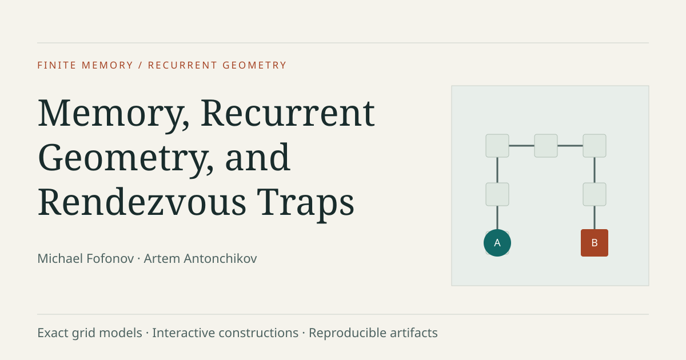

# Memory, Recurrent Geometry, and Rendezvous Traps in Induced Grid Mazes

**Michael Fofonov · Artem Antonchikov**

Two identical finite-state agents follow one deterministic rule in an induced square-grid maze. How does their memory constrain recurrent motion, and when can an adversary keep them apart forever?



[Open the interactive showcase](https://spicmaff.github.io/rendezvous-grid-mazes/) · [Read the canonical paper (PDF)](https://spicmaff.github.io/rendezvous-grid-mazes/research/paper/main.pdf) · [Explore the source map](public/claims.json) · [Inspect the proof artifacts](research/manifests/PROOF_ARTIFACTS.json)

The showcase includes an exact synchronous rendezvous sandbox, the support-capacity construction, an arbitrary-integer sharp-period calculator, a low-state result ladder, three-state positive/negative examples and basin comparisons, all 144 exact test instances with the certified 44 highlighted, and a canvas viewer of the actual 5212-cell universal host. Ten addressable views link directly to the frozen paper, data and checkers. The simulator is educational, not a proof engine; edited instances are explicitly illustrative.

Replays keep one persistent SVG and move both agents on the same presentation clock. Contact and cycle checks still use only exact integer-time tags. The active transition-table entries follow those tags; stepping through the support and alternating-family constructions highlights the traversed contour. The opening witness replays its released A-star trace. The host camera eases between exact views, anchors wheel zoom at the pointer, and zooms out during long fragment jumps. Reset, pause, navigation, hidden tabs and reduced-motion preferences settle or cancel presentation frames without changing the model. Theme choice persists locally; selected candidate details precede the gallery on small screens.

The motion preflight workflow runs the actual build in Chromium at a repository subpath before publication. It checks intermediate SVG positions, synchronous interpolation, exact endpoints, interrupted resets, camera flights, all canonical preset traces, mobile touch, themes and reduced motion; it saves screenshots and a real browser recording. The Pages workflow repeats the suite against the deployed bytes. Browser tooling stays outside the repository and is optional for the dependency-free build.

| Result | Scope | Proof basis |
| --- | --- | --- |
| Recurrent support capacity and sharp path periods | Least tagged cycles; tree support; maximum path period over geometries/controllers | Deductive |
| F(1)=4 and F(2)=7 | Radius-one induced grid mazes; two-state value also 7 on induced grid trees | Deductive |
| Two-state path threshold 8 | Finite induced paths | Analytic upper; exact finite lower certificate |
| One fixed four-state controller | Every finite induced path | Deductive |
| Three-state realization criterion | Prescribed own-mask contour-plus-matching cycles; one finite profile and sparse affine system | Deductive; finite scans validate implementation |
| 44 selected tests | Complete and minimum **within the fixed 144 candidates** | Computer-assisted certificate and packing |
| One 5212-cell universal host | Fixed induced subcubic tree; bad state-0 starts may depend on the ≤2-state controller | Deductive construction; exact coordinate validation |

Universal three-state path rendezvous remains **open**. Recurrent-cycle realization is not state-0 accessibility. The host gives the range **8 ≤ u₂ ≤ u₂,tree3 ≤ 5212**, not an optimum of 5212. Every exact size n≥5212 admits a universal induced grid-tree construction. The lower bound 8 is computer-assisted.

## Run the showcase

Python 3.10+ and Node 18+ suffice. No package installation, npm dependency, backend or network access is required for these commands:

```sh
python3 -B scripts/build.py
python3 -B scripts/check.py
node --test tests/*.test.mjs
python3 -B scripts/subpath_check.py
python3 -m http.server 8000 --directory dist
```

Open `http://localhost:8000/`. All resource links are relative, so the same output works at a GitHub Pages repository subpath. To replay a subpath locally:

```sh
mkdir -p preview/showcase
cp -R dist/. preview/showcase/
python3 -m http.server 8001 --directory preview
```

Open `http://localhost:8001/showcase/`. Remove the disposable `preview/` directory after the check. The ten views use hash navigation, e.g. `#simulator?preset=astar-u`, `#three`, `#tests` and `#host`. Initial asset loading is local; interaction uses those loaded assets with no runtime API. Use an HTTP server rather than opening `index.html` with a `file:` URL.

## GitHub Pages

The [public interactive showcase](https://spicmaff.github.io/rendezvous-grid-mazes/) and the [complete canonical paper](https://spicmaff.github.io/rendezvous-grid-mazes/research/paper/main.pdf) are published from [spicmaff/rendezvous-grid-mazes](https://github.com/spicmaff/rendezvous-grid-mazes), on the `main` branch. Pages uses **GitHub Actions** as its source. `.github/workflows/pages.yml` builds and tests the site, deploys `dist/` with the official Pages actions, then checks the deployed subpath in Chromium at desktop and mobile viewports. Real screenshots and console/network evidence are saved as the workflow's browser-QA artifact. This optional CI browser check installs Playwright outside the source tree; the local offline build and model tests above still require only Python and Node.

`public/config.json` is the single configuration for repository, arXiv, DOI and journal URLs. `repository_url` points to the confirmed GitHub repository. The arXiv, DOI and journal fields remain empty until actual author-supplied publication URLs exist. After any URL change, rebuild and keep the canonical paper unchanged. No publication year, DOI, arXiv identifier, journal, corresponding-author email or ORCID is fabricated in the citation files.

## Reproduce the scientific release

From `research/`, use new or empty external output directories:

```sh
python3 supplement/common/integrity.py
python3 supplement/verify_all.py --output /tmp/rendezvous-replay
python3 paper/build.py --output /tmp/rendezvous-paper --check-canonical
```

The full supplement needs Python 3.10+ and a GCC-compatible C++17 compiler, standard library only. It executes all 15 mandatory stages and compares 30 deterministic outputs before reporting `PASS_FULL_REPRODUCIBILITY`. Integrity-only checking does not replay proofs. The paper build needs the TeX/font toolchain documented in [research/README.md](research/README.md); a different toolchain may render the same mathematics without matching the canonical PDF bytes. Do not run Python with `-O`.

The canonical release records a successful full replay and byte-identical paper build. Site tests also run a minimal DOM smoke harness (not browser rendering) and cross-check all 4042 initially-far path pairs through size seven against canonical Python product trajectories. This validates the browser implementation; it does not replace the proof suite or strengthen any theorem.

## Sources and rights

`research/` is an exact, immutable copy of the 258-file scientific release. `site/` contains the new static interface; `scripts/` deterministically derives its assets from vendored sources; `site/data/provenance.json` records source and derived SHA-256 hashes. `public/claims.json` maps every substantial scientific component to its paper label and semantic sources.

Site/simulator/build code is MIT. New explanations and project data are CC BY 4.0. Copied manuscript/PDF/LaTeX/TikZ/bibliography retain the canonical author all-rights-reserved status. Canonical supplement categories and third-party font notices are preserved exactly. See [LICENSES/NOTICE.md](LICENSES/NOTICE.md) and its complete exact-path map. No third-party runtime assets are added. Author-side license/metadata confirmations remain as recorded in the canonical checklist.

Social preview: `site/social-preview.svg`, deterministically generated by `scripts/visual_assets.py` from the project’s own exact grid witness. Open Graph metadata uses the verified absolute Pages URL. The image remains SVG; support in external social-card crawlers varies. The companion delivery includes actual browser screenshots.

Affiliations: Michael Fofonov — Alferov University, St. Petersburg, Russia. Artem Antonchikov — Moscow Institute of Physics and Technology (National Research University), Dolgoprudny, Russian Federation. Exact addresses are retained in the paper, `CITATION.cff` and the authors view. See [citation.bib](citation.bib) and [CITATION.cff](CITATION.cff).
